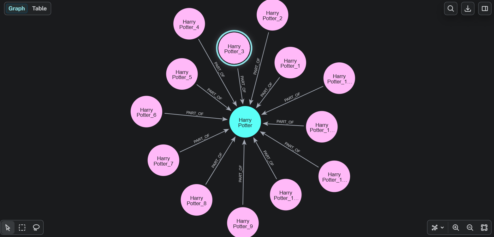
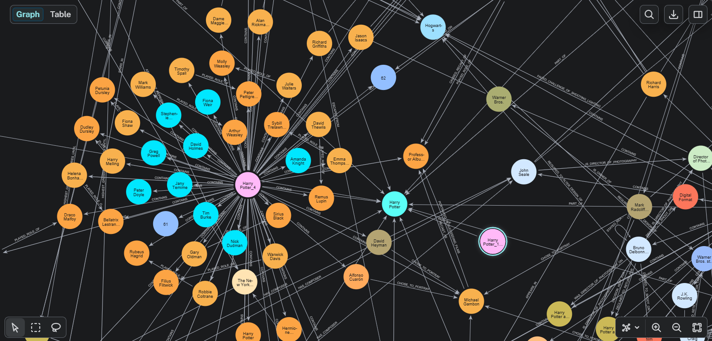

# GraphRAG
Performing Graph RAG on Documents using [Neo4J](https://neo4j.com/)<br><br>

In this project, I have used [Neo4J Aura](https://neo4j.com/product/auradb/) for storing the document chunks and the resultant Knowledge Graph.<br><br>
I have used LlamaIndex, only for creating the embedding and the LLM calls. I haven't used any wrapper methods for Knowledge Graph Extraction or for performing the Graph RAG search.<br><br>

## Knowledge Graph
### Dcoument-Chunk Nodes

Relation between the main document and its chunk nodes.
<br><br>

### Chunk and extracted nodes

At the center, we have the chunk node, and connected to it are all the nodes extracted from this text chunk.
<br><br><br>

## Data Processing

1. I have downloaded the text about Harry Potter from wikipedia using the python wikipedia library.
2. Then, I created the chunks of the document using ```LlamaIndex SentenceSplitter```.
3. For each chunk, I created embeddings using the ```gemnini-embedding-001``` model.
4. Then using Cypher query I added the document node and the chunks nodes in the ```neo4j``` database.
5. I also created the Vector Index using the Cypher Query.

## Knowledge Graph Creation

1. For creating the Knowledge Graph, I used ```gemini-2.5-flash-lite``` and a simple prompt to extract nodes and relationships from each chunk.
2. Then I added the nodes and their respective relationship in the neo4j database. I also added the relationship between the nodes and their respective chunk.


## Retrieval
1. For vector search, I used again the  ```gemnini-embedding-001``` model to create embeddings for the query, and using the Cypher query I have implemented the vector search to get the relevant chunk.
2. I have used LlamaIndex ```Neo4jGraphStore``` class to connect to the Neo4J Database and to extract the graph schema.
3. Then using a simple prompt, I have implemented a user query to cypher query chain.
4. Next, using the generated cypher query, I extract the nodes and relationship from the Neo4J Database.
5. Finally, using the rag response and the graph response, I generate the final response for the user query.


## Next Steps
1. Other more sophesticated chunking techniques can be used.
2. To have more control over the Knowledge Graph Creation, we could specify the kind of nodes and relationship we want. (For this task, one should have an understanding about the document, or already have a schema of the knowledge graph.)
3. After creating the Knowledge Graph, we can use techniques like Entity Resolution which merges similar nodes, thus removing rendundancies in the Knowledge Graph.
4. Finally, I have only used simple prompts, one can experiment and build-up on these simple prompts to get the desired responses from the LLM.